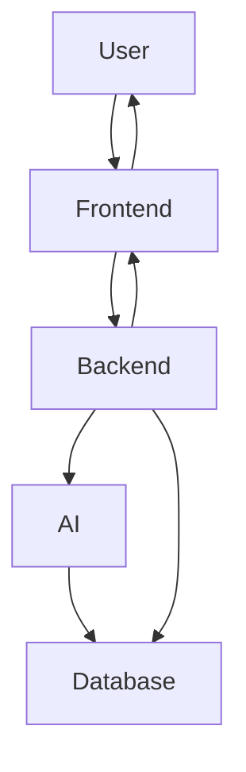
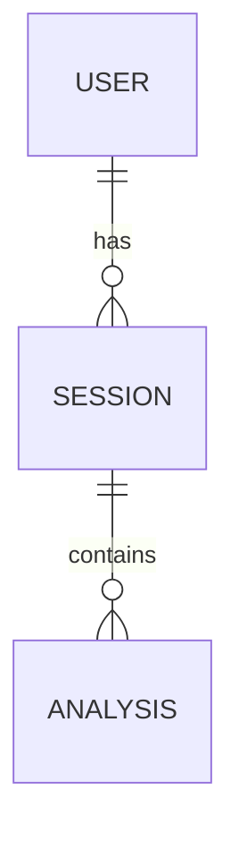

# TASK: Generate Complete Research Implementation Documentation

You are working inside my **actual final-year project repository**.

Your task is to thoroughly inspect the **entire project codebase** and generate a comprehensive Markdown documentation file named:

`PROJECT_IMPLEMENTATION_DOCUMENTATION.md`

This document will later be provided to another AI system (Claude) to help write a **research implementation paper** based strictly on what has actually been implemented in this project.

---

## CRITICAL INSTRUCTIONS

### 1. Analyze the actual codebase

Before generating the documentation:

* Inspect the complete directory structure.
* Read all relevant source-code files.
* Inspect frontend code.
* Inspect backend code.
* Inspect AI/ML code.
* Inspect configuration files.
* Inspect API implementations.
* Inspect database-related code.
* Inspect model-loading code.
* Inspect preprocessing and feature-extraction code.
* Inspect calculation/scoring functions.
* Inspect prompts used with LLMs.
* Inspect authentication and authorization.
* Inspect package/dependency files.
* Inspect environment/configuration files, but **DO NOT expose secrets, API keys, passwords, tokens, or credentials**.
* Inspect README files and existing documentation.
* Inspect scripts and utility files.
* Identify which components are actually functional and which are placeholders.

Do not rely only on filenames. Read the implementation and determine how each component actually works.

---

# MOST IMPORTANT RULE

## DO NOT INVENT ANYTHING

The documentation must describe the **actual implemented system**, not an idealized or proposed system.

If a feature is:

* implemented → mark it as **IMPLEMENTED**
* partially implemented → mark it as **PARTIALLY IMPLEMENTED**
* present only as a placeholder → mark it as **PLACEHOLDER**
* mentioned in comments/documentation but not implemented → mark it as **NOT IMPLEMENTED**
* planned for future work → mark it as **FUTURE WORK**
* impossible to verify from the code → mark it as **NOT VERIFIED**

Never create fake algorithms, formulas, datasets, accuracy values, model names, API endpoints, database tables, or experimental results.

If an exact value cannot be determined from the code, write:

`Not explicitly defined in the implementation.`

Do not guess.

---

# DOCUMENT STRUCTURE

Generate the Markdown document with the following sections.

---

# 1. Project Information

Include:

* Project title
* Project type
* Project objective
* Problem being addressed
* Motivation
* Research problem
* Proposed solution
* Main functionalities
* Current implementation scope
* Implemented modules
* Partially implemented modules
* Future modules/features

If the exact project title is available in the repository, use it.

Otherwise write:

`Project title: Not explicitly specified in repository.`

---

# 2. Executive Summary

Provide a concise technical summary explaining:

* What the system does
* Who uses it
* Main input
* Main processing pipeline
* AI/ML components
* Main outputs
* Feedback/reporting mechanism
* Database/storage
* Deployment architecture if identifiable

Do not exaggerate capabilities.

---

# 3. Research Motivation and Problem Statement

Explain:

* Existing problem
* Limitations of traditional approaches
* Why the implemented system was developed
* How the system attempts to address the problem
* Research motivation
* Expected contribution

Clearly separate:

### Existing Problem

from

### Implemented Solution

Do not claim research contributions that cannot be supported by the implementation.

---

# 4. System Scope

Create a table:

| Component/Feature | Status                   | Evidence in Code | Description |
| ----------------- | ------------------------ | ---------------- | ----------- |
| Feature           | IMPLEMENTED/PARTIAL/etc. | File/function    | Explanation |

Clearly distinguish:

* Implemented functionality
* Partially implemented functionality
* Future work

---

# 5. Complete Technology Stack

Create a detailed table.

## Frontend

Include:

* Framework
* Language
* UI library
* CSS framework
* State management
* Routing
* Browser APIs
* Charts/visualization libraries
* Other libraries

## Backend

Include:

* Programming language
* Framework
* API framework
* Authentication
* Authorization
* Middleware
* Validation
* Server configuration

## AI/ML

Include:

* Machine learning frameworks
* Deep learning frameworks
* NLP libraries
* Speech-processing libraries
* Computer-vision libraries
* LLMs
* Embedding models
* Vector databases
* Pretrained models

## Database

Include:

* Database type
* Database engine/version if available
* ORM/ODM
* Tables/collections
* Important relationships

## DevOps / Deployment

Include:

* Git
* GitHub
* Docker
* Cloud platform
* Hosting
* CI/CD if implemented
* Environment management

## Development Tools

Include:

* VS Code
* Python version
* Node.js version
* npm
* package managers
* virtual environments
* testing tools
* API testing tools

Only list technologies actually detected in the project.

---

# 6. Complete Directory Structure

Reproduce the actual project directory tree.

Example format:

```text
project/
├── frontend/
│   ├── src/
│   │   ├── components/
│   │   ├── pages/
│   │   └── ...
│   ├── package.json
│   └── ...
├── backend/
│   ├── ...
└── ...
```

Use the **actual directory structure**.

For every important directory explain:

* Purpose
* Important files
* Responsibilities

---

# 7. File-by-File Implementation Map

Create a detailed table:

| File | Type | Module | Purpose | Important Functions/Classes | Status |
| ---- | ---- | ------ | ------- | --------------------------- | ------ |

For important files, explain their implementation in detail.

Do not list irrelevant generated files such as:

* node_modules
* `.git`
* cache folders
* compiled binaries
* temporary files

unless they are technically relevant.

---

# 8. Overall System Architecture

Explain the complete architecture.

Include:

1. User
2. Frontend
3. Backend/API
4. AI/ML processing
5. Database
6. External services
7. LLM/model services
8. Output/dashboard

Provide a Mermaid architecture diagram if possible.

Example:



Replace the example with the **actual architecture discovered from the code**.

---

# 9. End-to-End System Workflow

Explain exactly what happens when a user interacts with the system.

Use a numbered workflow.

For example:

```text
1. User opens application
2. User authenticates
3. User selects module
4. System collects input
5. Input is sent to backend
6. Backend preprocesses input
7. AI model performs inference
8. Features are extracted
9. Metrics are calculated
10. Score is generated
11. Feedback is generated
12. Result is stored
13. Dashboard displays result
```

Replace this with the actual implementation.

---

# 10. Module-Wise Implementation

For EVERY implemented module create a separate subsection.

Use this structure:

## Module X — [Actual Module Name]

### Objective

Explain what the module does.

### Status

`IMPLEMENTED / PARTIALLY IMPLEMENTED / NOT IMPLEMENTED`

### Input

Explain exactly what enters the module.

### Processing Pipeline

Explain every processing step.

### Algorithms

Identify the exact algorithms used.

### Models

Identify:

* Model name
* Model type
* Version if available
* Pretrained/custom
* Input
* Output

### Feature Extraction

Explain every extracted feature.

### Calculations

Provide exact formulas.

### Thresholds

Document thresholds used in code.

### Scoring

Explain how scores are calculated.

### Output

Explain the final output.

### Files Responsible

List exact files and functions.

### API Endpoints

List APIs used by the module.

### Database Interaction

Explain what is stored/retrieved.

---

# 11. Speech Processing / Audio Analysis

If implemented, document everything related to audio.

Include:

* Audio acquisition
* Microphone access
* Recording
* Audio format
* Sampling rate
* Preprocessing
* Noise handling
* Speech-to-text
* ASR model
* Word extraction
* Sentence extraction
* Pause detection
* Speech duration
* Speaking duration
* Silence duration
* Speech rate
* Filler detection
* Repetition detection
* Disfluency detection
* Stammering/fumbling detection
* Phoneme analysis
* Pronunciation analysis
* Fluency calculation
* Confidence calculation

For every metric provide the **actual formula used by the implementation**.

For example:

```text
Speech Rate = Number of Words / Speaking Duration
```

ONLY include this if that is actually how the project calculates it.

If a metric is not explicitly calculated, write:

`Not explicitly calculated in the current implementation.`

---

# 12. Speech-to-Text / ASR

Document:

* ASR technology
* Model
* Input format
* preprocessing
* inference process
* output format
* timestamps if available
* confidence if available
* language configuration
* post-processing

Explain the complete pipeline:

```text
Audio
↓
Preprocessing
↓
ASR Model
↓
Transcript
↓
Text Processing
↓
Feature Extraction
```

Use the actual implementation.

---

# 13. NLP / Text Analysis

Document all NLP functionality.

Include:

* Tokenization
* Sentence segmentation
* Stop-word removal
* Lemmatization/stemming
* POS tagging
* Named entity recognition
* TF-IDF
* embeddings
* semantic similarity
* keyword extraction
* filler detection
* repetition detection
* sentiment analysis
* text quality
* LLM-based evaluation

Only document techniques actually implemented.

---

# 14. Video / Computer Vision Analysis

If implemented, document:

* Camera capture
* Video format
* Frame extraction
* FPS
* Image preprocessing
* Face detection
* Facial landmarks
* Eye detection
* Eye contact
* Head pose
* Facial expressions
* Body posture
* Gesture detection
* Body language
* Confidence estimation
* Frame-level calculations
* Aggregation across frames

For each metric explain:

```text
Input
↓
Preprocessing
↓
Model/Algorithm
↓
Feature extraction
↓
Calculation
↓
Aggregation
↓
Final score
```

Include exact formulas wherever available.

---

# 15. Communication Skill Analysis

If implemented, explain how the system evaluates communication.

Document every metric separately.

Possible metrics include:

* Fluency
* Speech rate
* Fillers
* Pauses
* Repetitions
* Eye contact
* Facial expression
* Body language
* Confidence
* Response quality
* Vocabulary
* Grammar
* Relevance
* Overall communication score

For each metric provide:

| Metric | Input | Calculation | Range | Threshold | Weight | Output |
| ------ | ----- | ----------- | ----- | --------- | ------ | ------ |

Only fill fields that actually exist.

---

# 16. Speech Therapy Module

If implemented, document:

* Therapy workflow
* Exercises
* User interaction
* Speech analysis
* Disfluency detection
* Repetition exercises
* Pronunciation exercises
* Breathing exercises
* Feedback
* Progress tracking
* Session history

Clearly identify what is actually implemented versus planned.

---

# 17. Generative AI / LLM Component

If an LLM is used, document:

* Model name
* Provider
* Version
* Local/API
* Temperature if specified
* Max tokens if specified
* Prompt structure
* System prompt
* User prompt
* Input data
* Output format
* Feedback generation
* Question generation
* Evaluation
* Post-processing

Do not expose API keys.

If prompts are stored in source code, summarize their purpose rather than exposing sensitive information.

---

# 18. Prompt Engineering

For every important AI prompt, explain:

* Purpose
* Input
* Expected output
* Constraints
* Context
* Variables
* Output format

Do not reveal credentials or secrets.

---

# 19. Mathematical Formulas and Calculations

This is one of the MOST IMPORTANT sections.

Find every numerical calculation in the code.

For each calculation provide:

### Metric Name

### Purpose

### Formula

### Variables

### Variable definitions

### Range

### Normalization

### Threshold

### Weight

### Aggregation

### Example

Use actual implementation values.

Example format:

```text
Metric:
Speech Rate

Formula:
Speech Rate = Total Spoken Words / Speaking Time

Where:
Total Spoken Words = ...
Speaking Time = ...

Unit:
words/minute
```

Also identify:

* weighted averages
* normalization
* min-max scaling
* percentages
* confidence scores
* composite scores
* thresholds
* classification logic

---

# 20. Overall Scoring System

If the system produces an overall score, determine exactly how it is calculated.

For example:

```text
Overall Score =
w1 × Speech Score +
w2 × Eye Contact Score +
w3 × Fluency Score +
...
```

ONLY provide this if the formula actually exists.

Document:

* individual scores
* weights
* normalization
* aggregation
* score range
* interpretation
* threshold conditions

---

# 21. Database Architecture

Document:

* Database
* Schema
* Tables/collections
* Columns/fields
* Primary keys
* Foreign keys
* Relationships
* Indexes
* CRUD operations

Create an ER diagram using Mermaid if possible.

Example:



Use the actual schema.

---

# 22. API Documentation

Find every API endpoint.

Create a table:

| Method | Endpoint | Purpose | Request | Response | Authentication | Source File |
| ------ | -------- | ------- | ------- | -------- | -------------- | ----------- |

Then explain important endpoints individually.

---

# 23. Authentication and Security

Document:

* Login
* Registration
* JWT
* Sessions
* Password hashing
* Role-based access
* Middleware
* Authorization
* CORS
* Input validation
* Environment variables

Never expose:

* passwords
* API keys
* JWT secrets
* database passwords
* private tokens

Use `[REDACTED]` where necessary.

---

# 24. Frontend Implementation

Explain:

* Pages
* Components
* Navigation
* Forms
* API integration
* State management
* Camera
* Microphone
* Charts
* Dashboards
* Results
* Error handling

Provide important component relationships.

---

# 25. Backend Implementation

Explain:

* Server startup
* Routes
* Controllers
* Services
* Middleware
* Models
* Database connection
* AI integration
* Error handling
* Logging

Provide the backend request lifecycle.

---

# 26. Data Flow

Document:

### Input Data

What data enters the system?

### Processing

How is it transformed?

### Feature Extraction

What features are produced?

### Analysis

What models/algorithms process them?

### Output

What does the user receive?

Create a Mermaid data-flow diagram.

---

# 27. Dependencies

Inspect:

* `package.json`
* `requirements.txt`
* `pyproject.toml`
* `pom.xml`
* `build.gradle`
* other dependency files

Create tables:

| Package | Version | Purpose | Used In |
| ------- | ------- | ------- | ------- |

Only include packages actually used.

---

# 28. Environment Configuration

Document required environment variables by NAME only.

Example:

```text
OPENAI_API_KEY=<required>
DATABASE_URL=<required>
JWT_SECRET=<required>
```

Never include actual values.

Also document:

* Python version
* Node version
* Java version
* database version
* required system software

---

# 29. Installation and Setup

Provide exact setup steps based on the repository.

Example:

```bash
git clone ...
cd ...
npm install
...
```

Do not invent commands.

Use commands found in:

* README
* package scripts
* configuration files
* Dockerfiles
* deployment configuration

---

# 30. Running the System

Document:

* frontend startup
* backend startup
* AI service startup
* database startup
* required ports
* environment configuration

Include exact commands.

---

# 31. Deployment Architecture

If deployment exists, document:

* frontend hosting
* backend hosting
* database hosting
* cloud services
* domain/API configuration
* environment variables
* deployment workflow

Clearly mark local-only components.

---

# 32. Experimental Setup

Determine from the repository what can be verified.

Document:

* hardware requirements
* software environment
* OS
* CPU/GPU
* RAM
* dataset
* sample count
* test conditions
* evaluation procedure

If experimental values are absent, write:

`Not available in the current repository.`

Do not fabricate experimental results.

---

# 33. Evaluation Metrics

Identify every evaluation metric actually implemented.

Examples:

* Accuracy
* Precision
* Recall
* F1-score
* MAE
* RMSE
* latency
* inference time
* processing time
* confidence

For each:

* Formula
* Input
* Output
* Calculation location

Do not invent numerical results.

---

# 34. Actual Results

Extract only results that are explicitly available in:

* code
* logs
* result files
* datasets
* screenshots
* documentation

Create:

| Experiment | Metric | Result | Source |
| ---------- | ------ | ------ | ------ |

If no results exist:

`No experimentally validated numerical results were found in the repository.`

---

# 35. Sample Input and Output

Where possible, document:

* sample user input
* sample transcript
* extracted features
* calculated metrics
* final feedback
* dashboard output

Do not expose personal information.

---

# 36. Error Handling

Document:

* validation errors
* API errors
* model errors
* database errors
* missing input
* camera/microphone errors
* authentication errors
* fallback mechanisms

---

# 37. Performance Considerations

Document measurable implementation details such as:

* processing time
* inference time
* API latency
* memory usage
* frame rate
* model size

Only include values that can be verified.

---

# 38. Limitations of Current Implementation

Identify limitations based on the actual implementation.

Examples:

* dependency on pretrained models
* limited dataset
* browser limitations
* environmental noise
* lighting conditions
* real-time processing limitations
* lack of large-scale validation

Do not make unsupported claims.

---

# 39. Implemented vs Proposed Features

Create a very clear table:

| Feature | Implementation Status | Evidence      | Research Paper Treatment |
| ------- | --------------------- | ------------- | ------------------------ |
| Feature | Implemented           | File/function | Experimental result      |
| Feature | Partial               | File/function | Discuss limitation       |
| Feature | Future                | Documentation | Future work              |

This section is extremely important for avoiding false claims in the research paper.

---

# 40. Research Contribution Supported by Implementation

Based ONLY on the implemented system, identify potential technical contributions.

For each contribution provide:

* Contribution
* Supporting implementation
* Relevant files
* Evidence
* Limitation

Do not claim novelty unless the code/documentation provides sufficient evidence.

---

# 41. Reproducibility Information

Provide everything another researcher would need to reproduce the implementation:

* Software versions
* Dependencies
* Models
* APIs
* Environment variables
* Installation
* Commands
* Dataset
* Configuration
* Database
* Processing pipeline

---

# 42. Research Paper Mapping

Create a final table mapping implementation details to research-paper sections.

| Implementation Information | Research Paper Section    |
| -------------------------- | ------------------------- |
| Problem                    | Introduction              |
| Research gap               | Introduction/Related Work |
| Architecture               | Methodology               |
| Modules                    | Methodology               |
| Algorithms                 | Methodology               |
| Mathematical formulas      | Methodology               |
| Experimental setup         | Experiments               |
| Results                    | Results                   |
| Limitations                | Discussion                |
| Future work                | Conclusion/Future Work    |

---

# 43. Verification Checklist

At the end, generate a checklist:

```text
[ ] Complete directory structure verified
[ ] Frontend inspected
[ ] Backend inspected
[ ] AI/ML code inspected
[ ] Database inspected
[ ] API endpoints verified
[ ] Mathematical formulas verified
[ ] Scoring logic verified
[ ] Dependencies verified
[ ] Models verified
[ ] Implemented features identified
[ ] Partial features identified
[ ] Future features identified
[ ] Experimental results verified
[ ] Secrets excluded
[ ] No unsupported claims added
```

---

# 44. Unknown / Missing Information

Create a final section:

## Information Not Found in Repository

List everything that could not be verified.

Examples:

```text
- Exact dataset size
- Training accuracy
- Hardware configuration
- Exact model version
- Experimental test results
```

This section is important because it tells me what information I still need to provide manually.

---

# DOCUMENT QUALITY REQUIREMENTS

The final Markdown file must be:

* technically detailed
* research-paper ready
* structured
* easy to read
* precise
* evidence-based
* reproducible
* free from fabricated information

Use:

* Markdown headings
* tables
* bullet points
* numbered workflows
* Mermaid diagrams
* code blocks
* mathematical notation where appropriate

---

# IMPORTANT RESEARCH WRITING RULE

The documentation is intended to become the factual foundation for a research paper.

Therefore:

**Never convert an intended feature into an implemented feature.**

For example, if documentation says:

> "The system will analyze eye contact."

but there is no actual implementation, classify it as:

`FUTURE WORK / NOT IMPLEMENTED`

Do not write:

> "The system analyzes eye contact."

Similarly, if a model is imported but never actually used for inference, mark it as:

`IMPORTED BUT NOT VERIFIED AS USED`

---

# FINAL VALIDATION

Before finishing:

1. Re-scan the repository.
2. Verify that every major feature mentioned in the documentation exists in the code.
3. Verify formulas against actual implementation.
4. Verify model names against actual imports/configuration.
5. Verify API endpoints against actual route definitions.
6. Verify database fields against actual schemas/models.
7. Verify package versions.
8. Remove unsupported claims.
9. Remove secrets.
10. Clearly distinguish implemented, partial, placeholder, and future features.

Then create:

`PROJECT_IMPLEMENTATION_DOCUMENTATION.md`

in the **root directory of the project**.

Do not merely explain what you would document.

**Actually inspect the repository and generate the complete `.md` file.**
