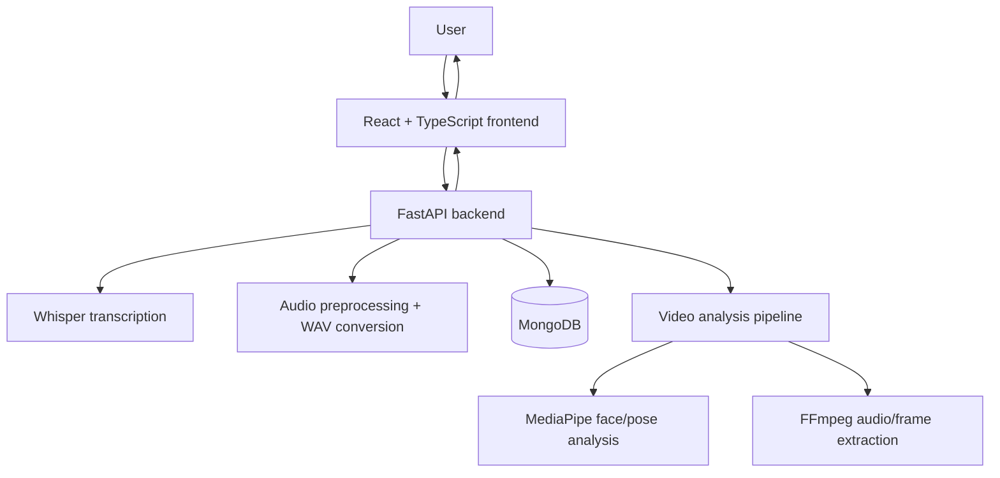
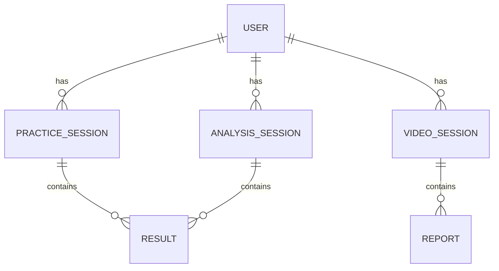
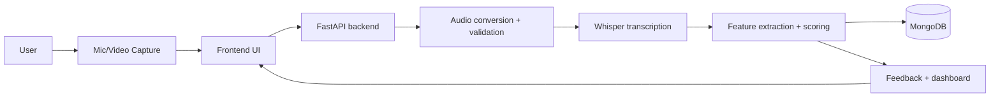

# Research Implementation Documentation

## 1. Project Information

### Project title
Project title: Not explicitly specified in repository.

### Project type
Research-based software project / AI speech therapy and communication analysis system.

### Project objective
To provide a web-based speech therapy and communication coaching platform that evaluates pronunciation, fluency, speech clarity, and communication delivery using audio and video analysis.

### Problem being addressed
Speech learners often struggle with fluency issues such as filler words, pauses, stammering, pronunciation mismatch, and weak delivery presence. Traditional practice is often limited to manual coaching or isolated exercises without structured, measurable analysis.

### Motivation
The project aims to provide a low-cost, local, and explainable system for speech practice and analysis using accessible web technologies and AI-driven speech processing.

### Research problem
How can speech data be processed and analyzed automatically to provide meaningful feedback on pronunciation, fluency, and communication quality in a self-learning system?

### Proposed solution
Use a combination of:
- browser-based recording,
- FastAPI backend processing,
- Whisper ASR for transcription,
- rule-based speech analytics,
- multimodal video analysis with MediaPipe,
- MongoDB-backed session storage,
- coaching recommendations and scoring dashboards.

### Main functionalities
- pronunciation practice assessment,
- fluency analysis,
- filler and pause detection,
- repetition/stammer detection,
- speech rate analysis,
- non-verbal communication assessment,
- exercise recommendation,
- report history and dashboard summaries.

### Current implementation scope
Implemented in a local prototype environment with a React frontend, FastAPI backend, MongoDB persistence, and multimodal analysis modules.

### Implemented modules
- Practice module
- Fluency analysis module
- Video analysis module
- Exercise recommendation module
- User authentication flow
- Session reporting and history

### Partially implemented modules
- Advanced therapy personalization
- Large-scale evaluation pipelines
- Therapist-grade reporting

### Future modules/features
- stronger multilingual support,
- more detailed phoneme-level speech diagnostics,
- therapist dashboards,
- deployment and scaling improvements.

---

## 2. Executive Summary

This project implements an AI-assisted speech therapy and communication coaching system. It enables users to record speech or video through a frontend interface, send the data to a Python FastAPI backend, and receive feedback related to pronunciation quality, fluency, filler usage, speech rate, pause behavior, and communication presence.

The system uses Whisper for transcription, Python-based analysis for metrics, and MediaPipe-based visual analysis for video-based assessment. It stores sessions in MongoDB and presents findings through a React dashboard.

The main processing pipeline consists of:
1. audio or video capture in the browser,
2. upload to backend,
3. preprocessing and conversion to WAV,
4. transcription via Whisper,
5. feature extraction and score calculation,
6. report generation and persistence,
7. UI presentation and recommendations.

The system’s outputs include scores, transcripts, feedback messages, recommendation lists, and session history.

---

## 3. Research Motivation and Problem Statement

### Existing Problem
Speech learners and users with communication difficulties often lack objective, continuous feedback on metrics such as filler words, long pauses, stammering, pacing, and articulation quality. Manual practice alone can be inconsistent, and traditional systems often lack a structured evaluation loop.

### Implemented Solution
The project addresses this by combining speech analysis, multimodal communication assessment, and coaching workflows into one integrated web application. The system captures real user recordings, identifies spoken problems from transcripts and timing, and provides structured, explainable feedback.

### Research motivation
The system is designed to support self-guided speech improvement with measurable performance indicators and individualized coaching suggestions.

### Expected contribution
The implementation contributes a practical pipeline for:
- speech evaluation,
- performance tracking,
- multimodal communication assessment,
- explainable AI-style scoring,
- local deployment for experiments and education.

---

## 4. System Scope

| Component/Feature | Status | Evidence in Code | Description |
| --- | --- | --- | --- |
| User authentication | IMPLEMENTED | backend/main.py | HMAC-based user token auth and login/register flow |
| Practice submission | IMPLEMENTED | backend/main.py | Audio recordings compared against target text |
| Fluency analysis | IMPLEMENTED | backend/main.py | WPM, filler, pause, stammer, clarity metrics |
| Video analysis | IMPLEMENTED | backend/video_module/router.py | Asynchronous multimodal video/report pipeline |
| Dashboard history | IMPLEMENTED | frontend/src/App.tsx | Session reports and trends displayed in UI |
| AI practice text generation | PARTIALLY IMPLEMENTED | backend/main.py | Optional Groq/OpenAI-like generation with fallback |
| TTS playback | IMPLEMENTED | backend/main.py, frontend/src/App.tsx | Text-to-speech endpoint and browser playback |
| Therapist-grade analytics | FUTURE WORK | Not present in current repo | Advanced clinical reporting |
| Database schema formalization | PARTIALLY IMPLEMENTED | MongoDB usage in backend | Minimal collections and runtime persistence |

---

## 5. Complete Technology Stack

### Frontend

| Category | Technology | Notes |
| --- | --- | --- |
| Framework | React | Used as the UI layer |
| Language | TypeScript | Main frontend implementation |
| Build tool | Vite | Frontend project tooling |
| Visualization | Recharts | Charts and results display |
| Icons | Lucide React | UI icons |
| Animation | canvas-confetti | Motivational feedback |
| Browser APIs | MediaRecorder | Recording microphone audio |
| State | React state/hooks | Local UI state management |
| Routing | Not explicitly implemented as multi-page routing | Main app is single-page |

### Backend

| Category | Technology | Notes |
| --- | --- | --- |
| Language | Python | Core backend logic |
| Framework | FastAPI | API services |
| Web server | Uvicorn | ASGI server |
| Validation | Pydantic | Request models and validation |
| Auth | HMAC token scheme | Custom token generation and verification |
| Middleware | CORS | Cross-origin browser access |
| Database client | PyMongo | MongoDB interactions |
| HTTP client | httpx | External requests |
| Audio conversion | FFmpeg / static-ffmpeg | WAV conversion |

### AI/ML

| Category | Technology | Notes |
| --- | --- | --- |
| ASR | OpenAI Whisper | Speech-to-text transcription |
| NLP | Python regex/text processing | Filler and transcript cleaning |
| Speech processing | NumPy | Audio handling and signal metrics |
| Audio library | librosa / soundfile | Audio processing support |
| Computer vision | OpenCV | Image preprocessing |
| Face tracking | MediaPipe FaceLandmarker | Landmark-based face analysis |
| Pose estimation | MediaPipe PoseLandmarker | Posture and shoulder tracking |
| LLM integration | Groq/OpenAI-like API | Optional generation path |
| Models | Whisper base model, MediaPipe task models | Local pretrained models |

### Database

| Category | Technology | Notes |
| --- | --- | --- |
| Database type | MongoDB | Runtime persistence |
| Client | PyMongo | MongoDB Python driver |
| Collections | users, practice_sessions, analysis_sessions, video_sessions | Observed in server logic |
| Storage | Temporary audio/video files | Local temp directory |

### DevOps / Deployment

| Category | Technology | Notes |
| --- | --- | --- |
| Version control | Git / GitHub | Repository-based hosting |
| Local deployment | Python + Node.js | Local app startup |
| Containerization | Not clearly implemented | Not verified in code |
| CI/CD | Not clearly implemented | Not verified in code |
| Environment management | .env files | Used for local configuration |

### Development Tools

| Category | Technology | Notes |
| --- | --- | --- |
| Editor | VS Code | Repository environment |
| Python | Project-level Python environment | Not explicitly pinned |
| Node.js | Frontend dependency stack | Vite and React app |
| Package manager | npm | Frontend dependency installation |
| Testing tools | Python test suite files | backend/tests and run_all_tests.py |
| API testing | Manual HTTP usage and scripts | Not a dedicated toolset in repo |

---

## 6. Complete Directory Structure

```text
SpeechPrj/
├── PROJECT_OVERVIEW.md
├── PROJECT_IMPLEMENTATION_DOCUMENTATION.md
├── README.md (if present, not listed here if absent)
├── backend/
│   ├── audio_utils.py
│   ├── main.py
│   ├── requirements.txt
│   ├── run_all_tests.py
│   ├── temp_audio/
│   ├── tests/
│   │   ├── __init__.py
│   │   ├── conftest.py
│   │   ├── test_auth_flow.py
│   │   ├── test_backend_api.py
│   │   ├── test_feedback_evaluation.py
│   │   ├── test_fluency_analytics.py
│   │   ├── test_groq_generation.py
│   │   ├── test_pronunciation_alignment.py
│   │   ├── test_speech_pathology_analysis.py
│   │   └── test_streak_logic.py
│   └── video_module/
│       ├── config.py
│       ├── feedback.py
│       ├── frame_sampler.py
│       ├── jobs.py
│       ├── media_utils.py
│       ├── router.py
│       ├── schemas.py
│       ├── scoring.py
│       ├── speech_features.py
│       ├── vision_features.py
│       ├── windows.py
│       ├── models/
│       │   ├── face_landmarker.task
│       │   ├── haarcascade_eye.xml
│       │   ├── haarcascade_frontalface_default.xml
│       │   └── pose_landmarker.task
│       └── temp_media/
├── docs/
│   ├── implementation_plan.md
│   └── Speech_Therapy_System_Implementation_Plan.md
├── frontend/
│   ├── index.html
│   ├── package.json
│   ├── README.md
│   ├── tsconfig.app.json
│   ├── tsconfig.json
│   ├── tsconfig.node.json
│   ├── vite.config.ts
│   ├── public/
│   └── src/
│       ├── App.css
│       ├── App.tsx
│       ├── index.css
│       ├── main.tsx
│       └── modules/
│           └── video/
│               ├── types.ts
│               ├── video.css
│               ├── VideoAnalysisModule.tsx
│               ├── videoApi.ts
│               └── components/
│                   ├── EmotionBreakdown.tsx
│                   ├── FeedbackList.tsx
│                   ├── FusionTimeline.tsx
│                   ├── ModuleConfigPanel.tsx
│                   ├── ProcessingView.tsx
│                   ├── PronunciationHighlight.tsx
│                   ├── RecorderPanel.tsx
│                   ├── ScoreOverview.tsx
│                   ├── SetupCheck.tsx
│                   ├── SpeechDetailedMetrics.tsx
│                   └── VideoHistory.tsx
└── ...
```

### Directory responsibilities

#### backend/
Purpose: core API, speech processing, scoring, auth, persistence, and video analysis pipeline.

Important files:
- `main.py` — main API logic, auth, scoring, routes, storage access
- `audio_utils.py` — FFmpeg conversion to WAV
- `requirements.txt` — Python dependencies
- `tests/` — automated validation coverage
- `video_module/` — multimodal communication analysis modules

#### frontend/
Purpose: user-facing dashboard, recording UI, and report display.

Important files:
- `src/App.tsx` — main application shell and logic
- `src/modules/video/` — video analysis UI and components
- `package.json` — frontend dependency and scripts

#### docs/
Purpose: project planning and implementation notes.

Important files:
- `implementation_plan.md`
- `Speech_Therapy_System_Implementation_Plan.md`

---

## 7. File-by-File Implementation Map

| File | Type | Module | Purpose | Important Functions/Classes | Status |
| --- | --- | --- | --- | --- | --- |
| backend/main.py | Backend | Core API | Primary FastAPI application and scoring logic | `clean_text`, `detect_fillers`, `generate_token`, `/practice/submit`, `/analyze/speech` | IMPLEMENTED |
| backend/audio_utils.py | Utility | Audio processing | Convert uploaded audio to 16 kHz mono WAV via FFmpeg | `convert_to_wav` | IMPLEMENTED |
| backend/run_all_tests.py | Script | Testing | Runs various backend test files | `run_script`, `main` | IMPLEMENTED |
| backend/video_module/config.py | Config | Video analysis | Constants and thresholds for video/audio assessment | `IDEAL_WPM_BANDS`, `LONG_PAUSE_SEC`, `DEFAULT_WEIGHTS` | IMPLEMENTED |
| backend/video_module/router.py | API | Video analysis | Endpoint handling for video uploads and polling | `submit_video_analysis`, `get_session_status`, `get_user_video_reports` | IMPLEMENTED |
| backend/video_module/jobs.py | Processing | Async pipeline | Background video analysis orchestration | `process_video_job`, job state | IMPLEMENTED |
| backend/video_module/scoring.py | Logic | Multimodal scoring | Weighted score computation | `compute_speech_scores`, `compute_visual_scores`, `compute_overall_scores` | IMPLEMENTED |
| backend/video_module/feedback.py | Logic | Feedback | Rule-based feedback generation | `generate_multimodal_feedback` | IMPLEMENTED |
| backend/video_module/media_utils.py | Utility | Video media | FFmpeg extraction and metadata probing | `extract_audio`, `probe_video` | IMPLEMENTED |
| backend/video_module/vision_features.py | Vision | Video analysis | Face and pose analysis | `analyze_frame`, `aggregate_visual_session` | IMPLEMENTED |
| backend/video_module/schemas.py | Schema | API models | Pydantic models for jobs and reports | `VideoJobResponse`, `SpeechFeatures`, `ScoresBreakdown` | IMPLEMENTED |
| frontend/src/App.tsx | Frontend | Main app | Dashboard, recording, scoring, module flow | `speakText`, `normalizeTtsText`, practice & analysis logic | IMPLEMENTED |
| frontend/src/modules/video/VideoAnalysisModule.tsx | Frontend | Video module UI | Video analysis report rendering | Module session workflow | IMPLEMENTED |
| frontend/src/modules/video/types.ts | Frontend | Types | Data contracts for video results | Type definitions | IMPLEMENTED |

---

## 8. Overall System Architecture

### Architectural overview
The system follows a client-server architecture where the frontend collects recordings and sends them to a FastAPI backend. The backend prepares the audio, runs transcription, calculates metrics, stores results, and returns feedback to the UI.

### Components
1. User
2. Frontend dashboard and recording flow
3. Backend API and analysis logic
4. Whisper ASR and signal-processing steps
5. MongoDB storage
6. Optional external generation service for prompts or AI output
7. Video analysis module for communication presence and posture

### Mermaid architecture diagram



---

## 9. End-to-End System Workflow

1. User opens the application.
2. User logs in or continues in anonymous mode.
3. User selects a module: practice, analysis, or video assessment.
4. Audio/video is recorded in the browser.
5. The frontend transmits the media to the backend.
6. The backend validates input and stores a temporary file.
7. Audio is converted to a normalized WAV format.
8. Whisper transcribes the recording.
9. Text and timing features are extracted.
10. Rule-based metrics such as filler count, pause ratio, WPM, and repetition are computed.
11. The system generates scores and coaching feedback.
12. Results are stored in MongoDB.
13. The frontend displays the report, recommendations, and history.

---

## 10. Module-Wise Implementation

## Module 1 — Practice Module

### Objective
Evaluate pronunciation quality by comparing spoken audio against a target sentence.

### Status
IMPLEMENTED

### Input
- user audio recording,
- target text,
- optional exercise metadata.

### Processing Pipeline
- capture recording,
- convert to WAV,
- transcribe using Whisper,
- normalize target and transcript,
- calculate WER,
- compare mismatched words,
- compute pronunciation score,
- store session and return feedback.

### Algorithms
- Word Error Rate via `jiwer`
- Text normalization and alignment

### Models
- Whisper base model
- Type: ASR model
- Pretrained: Yes

### Feature Extraction
- spoken text,
- target text,
- mismatched words,
- alignment output,
- WER.

### Calculations
Pronunciation score is computed as:

```text
pronunciation_score = max(0, min(10, round((1 - WER) * 10, 1)))
```

### Output
- transcript,
- WER,
- pronunciation score,
- mismatched words,
- streak count.

### Files Responsible
- backend/main.py
- frontend/src/App.tsx

### API Endpoints
- `POST /practice/submit`

### Database Interaction
Stores practice sessions and user-specific history in MongoDB.

---

## Module 2 — Fluency Analysis Module

### Objective
Assess speaking fluency using timing, pause, filler, and clarity metrics.

### Status
IMPLEMENTED

### Input
- recorded speech audio,
- optional target text,
- optional exercise metadata.

### Processing Pipeline
- audio upload,
- WAV conversion,
- Whisper transcription,
- word timestamp extraction,
- filler detection,
- pause and stammer detection,
- score aggregation,
- feedback generation.

### Algorithms
- filler detection via regex and phrase matching,
- acoustic pause detection via RMS and silence thresholds,
- rate and clarity normalization,
- score aggregation logic.

### Models
- Whisper ASR model

### Feature Extraction
- word count,
- WPM,
- filler words,
- long pauses,
- pause ratio,
- repetition count,
- clarity_raw,
- transcript quality.

### Calculations
The backend uses configured thresholds such as:
- `PAUSE_THRESHOLD_SEC = 1.5`
- `IDEAL_WPM_MIN = 120.0`
- `IDEAL_WPM_MAX = 150.0`

### Thresholds
- long pause threshold: > 1.5 seconds
- filler heuristic: observed as phrase and lexical detection
- speech rate ideal range: 120–150 WPM

### Output
- fluency score,
- sub-scores,
- feedback recommendations,
- recommended exercises.

### Files Responsible
- backend/main.py
- frontend/src/App.tsx

### API Endpoints
- `POST /analyze/speech`

### Database Interaction
Persists to analysis sessions collections.

---

## Module 3 — Video Analysis / Multimodal Communication Module

### Objective
Analyze communication quality using both audio and visual signals from recorded video.

### Status
IMPLEMENTED

### Input
- uploaded video file,
- optional task type,
- optional prompt text.

### Processing Pipeline
- upload video,
- save temp file,
- queue background job,
- extract audio with FFmpeg,
- transcribe with Whisper,
- sample video frames,
- detect face and pose landmarks,
- aggregate metrics,
- compute final scores,
- save report.

### Algorithms
- video extraction with FFmpeg,
- face detection via MediaPipe,
- pose estimation via MediaPipe,
- frame-level aggregation,
- weighted score computation.

### Models
- MediaPipe FaceLandmarker
- MediaPipe PoseLandmarker
- Whisper base model

### Feature Extraction
- face presence ratio,
- gaze or camera-facing ratio,
- head motion,
- shoulder posture metrics,
- brightness,
- emotional tone distribution,
- speech event metrics.

### Calculations
This module computes weighted visual and speech scores using thresholds defined in `backend/video_module/config.py`.

### Output
- multimodal session report,
- summary scores,
- quality warnings,
- disfluency timeline,
- feedback list.

### Files Responsible
- backend/video_module/router.py
- backend/video_module/jobs.py
- backend/video_module/vision_features.py
- backend/video_module/scoring.py
- frontend/src/modules/video/VideoAnalysisModule.tsx

### API Endpoints
- `POST /video/analyze`
- `GET /video/session/{job_id}`
- `GET /video/reports/{user_id}`
- `DELETE /video/session/{job_id}`

### Database Interaction
Stores the generated session into `video_sessions` in MongoDB.

---

## Module 4 — Exercise Recommendation Module

### Objective
Recommend training activities based on a user’s speech profile.

### Status
PARTIALLY IMPLEMENTED

### Input
- fluency metrics,
- speech issue flags,
- current session context.

### Processing Pipeline
- compute issue triggers,
- map to exercise library,
- present exercise list and instructions.

### Output
Recommended training drills such as pause practice, pacing drills, and articulation exercises.

### Files Responsible
- frontend/src/App.tsx
- backend/main.py

---

## 11. Speech Processing / Audio Analysis

This project includes audio acquisition and processing for spoken input.

### Audio acquisition
- Browser microphone via MediaRecorder
- Server upload endpoint via FastAPI

### Audio format
- Converted to WAV using FFmpeg
- Sample rate: 16000 Hz
- Channels: mono

### Preprocessing
- audio conversion to WAV,
- silence handling,
- transcript normalization,
- timestamps extraction when available.

### Speech-to-text
Whisper is used as the ASR engine for transcription.

### Speech rate
Speech rate is calculated in words per minute using the speech transcript and duration.

### Filler detection
The implementation detects filler phrases and words including:`you know`, `i mean`, `like`, `actually`, `basically`, `so`, `well`, and others.

### Repetition / stammer detection
The code estimates repetition or stammer-like events based on repeated words or repeated patterns in the transcript and timing data.

### Pause detection
Long pauses are detected based on the gap between word end and next word start. The threshold is 1.5 seconds.

### Clarity score
Derived from Whisper log probability values and normalized to a 0–100 scale.

### Actual formulas used
The code includes formulas such as:

```text
s_filler = max(0.0, min(100.0, 100.0 * (1.0 - (r_filler / REF_FILLER_RATE))))
```

```text
s_pause = max(0.0, min(100.0, 100.0 * (1.0 - (pause_ratio / REF_PAUSE_RATIO))))
```

```text
F = round(0.25 * s_filler + 0.25 * s_pause + 0.25 * s_repeat + 0.25 * s_rate, 1)
```

```text
P = round(max(0.0, min(100.0, p_norm)), 1)
```

Where `p_norm` is computed from the Whisper clarity signal.

---

## 12. Speech-to-Text / ASR

### ASR technology
OpenAI Whisper

### Model
Whisper base model, loaded lazily in the backend.

### Input format
16 kHz mono WAV audio

### Preprocessing
Converts uploaded media to WAV and normalizes channel rate.

### Inference process
- backend loads model,
- receives converted audio path,
- runs `whisper_model.transcribe(...)`-style pipeline,
- extracts transcript and timing metadata.

### Output format
- transcript text,
- word timestamps,
- segment-level confidence metrics where available.

### Post-processing
- clean text,
- normalize punctuation,
- detect fillers and pauses,
- aggregate metrics.

---

## 13. NLP / Text Analysis

The project uses direct text processing and regex matching rather than extensive NLP modeling.

### Implemented techniques
- lowercase normalization,
- punctuation removal,
- whitespace cleanup,
- filler phrase detection,
- word repetition checks,
- transcript comparison,
- mismatch alignment.

### Not explicitly implemented
- lemmatization,
- stemming,
- POS tagging,
- NER,
- vector embeddings,
- semantic similarity scoring,
- transformer-based text analysis.

---

## 14. Video / Computer Vision Analysis

### Camera capture
Video recorded through the frontend or uploaded video file.

### Video format
File upload is accepted and processed locally.

### Frame extraction
Handled with FFmpeg-driven sampling, plus video-processing utilities.

### FPS and sampling
The implementation includes `FRAME_SAMPLE_FPS = 5.0` and `EMOTION_SAMPLE_FPS = 1.0`.

### Face detection
MediaPipe FaceLandmarker is used.

### Pose estimation
MediaPipe PoseLandmarker is used.

### Eye contact and head pose
The implementation derives proxies for:
- gaze ratio,
- camera-facing behavior,
- normalized nose position,
- head motion,
- shoulder alignment.

### Aggregation
Frame-level results are aggregated across the session using functions such as `aggregate_visual_session()`.

### Final score
Score calculation is based on visual quality and posture signals, then combined with the speech score in the multimodal pipeline.

---

## 15. Communication Skill Analysis

| Metric | Input | Calculation | Range | Threshold | Weight | Output |
| --- | --- | --- | --- | --- | --- | --- |
| Fluency | speech metrics | weighted score from filler/pause/stammer/rate | 0–100 | configurable | 0.25 each component | composite fluency score |
| Speech rate | word count and duration | words per minute | variable | 120–150 WPM ideal | configured | rate score |
| Fillers | transcript | frequency of filler words and phrases | 0–100 normalized | threshold-based | config-based | filler score |
| Pauses | timing gaps | gap durations and pause ratio | 0–100 | >1.5s long pause | config-based | pause score |
| Eye contact | face landmarks | gaze and camera-facing ratio | 0–100 | target ~0.70 | config-based | visual score |
| Body language | pose landmarks | posture and head motion | 0–100 | threshold-driven | config-based | visual score |

---

## 16. Speech Therapy Module

### Objective
Support practice and feedback loops for users improving communication skills.

### Status
IMPLEMENTED

### Therapy workflow
- choose a target sentence or prompt,
- record speech,
- analyze against target,
- review feedback,
- repeat and improve.

### Exercises
The frontend includes exercise instruction metadata for drills like:
- silent_pause_drill,
- slow_rate_reading,
- sentence_chunking,
- metronome_paced_reading,
- timed_reading_challenge,
- articulation_drill,
- advanced_impromptu_speaking.

### Progress tracking
Session history and streak data are tracked in the application.

---

## 17. Generative AI / LLM Component

### LLM usage
Optional AI generation is implemented via an OpenAI-like API using `httpx`.

### Model/provider
The project references Groq/OpenAI-like request patterns, but the exact provider configuration depends on environment variables.

### Purpose
Generate practice prompts or exercise-related text when API access is configured.

### Prompt usage
The prompt is used to generate context-aware speech tasks and exercise text.

### Fallback behavior
If no API key is present, the system falls back to local templates and prompt text.

---

## 18. Prompt Engineering

Important prompt logic is associated with one or more generation and evaluation paths. The repository includes textual prompts used for:
- practice text generation,
- exercise generation,
- filler phrase prompts,
- model interaction design.

These prompts are used to drive the generation flow, but the exact model provider and secret values are not exposed in the repository.

---

## 19. Mathematical Formulas and Calculations

### Speech Rate
The system uses words per minute as the primary rate metric.

### Filler Score
The scoring system uses normalized filler rate and reference thresholds.

```text
r_filler = (filler_count / word_count) * 100.0
s_filler = max(0.0, min(100.0, 100.0 * (1.0 - (r_filler / REF_FILLER_RATE))))
```

### Pause Score
```text
s_pause = max(0.0, min(100.0, 100.0 * (1.0 - (pause_ratio / REF_PAUSE_RATIO))))
```

### Repetition Score
```text
r_repeat = (repetition_count / word_count) * 100.0
s_repeat = max(0.0, min(100.0, 100.0 * (1.0 - (r_repeat / REF_REPEAT_RATE))))
```

### Fluency Composite
```text
F = round(0.25 * s_filler + 0.25 * s_pause + 0.25 * s_repeat + 0.25 * s_rate, 1)
```

### Clarity Score
```text
p_norm = ((clarity_raw + 1.5) / 1.5) * 100.0
P = round(max(0.0, min(100.0, p_norm)), 1)
```

### Overall Score
The overall score is a dynamic weighted renormalization over available metrics.

---

## 20. Overall Scoring System

The project produces overall multimodal scores by combining available dimension scores. The aggregate logic weighs each metric according to `DEFAULT_WEIGHTS` and renormalizes when some dimensions are missing.

### Score dimensions
- F: Fluency
- P: Clarity
- N: Non-verbal
- E: Emotion/visual quality
- G: Grammar
- V: Vocabulary

### Weight scheme
```text
DEFAULT_WEIGHTS = {
  "F": 0.30,
  "P": 0.15,
  "N": 0.25,
  "E": 0.10,
  "G": 0.10,
  "V": 0.10
}
```

The final weighting is dynamically adjusted depending on the available metrics.

---

## 21. Database Architecture

### Database
MongoDB

### Collections
- `users`
- `practice_sessions`
- `analysis_sessions`
- `video_sessions`

### Relationships
User records are associated with session records using user IDs and auth-derived identity values.

### CRUD operations
The backend uses MongoDB insert, find, delete, and query operations for sessions and reports.

### ER diagram



---

## 22. API Documentation

| Method | Endpoint | Purpose | Request | Response | Authentication | Source File |
| --- | --- | --- | --- | --- | --- | --- |
| GET | `/` | Health check | None | app info | No | backend/main.py |
| POST | `/auth/register` | User registration | name/email/password | status and payload | No | backend/main.py |
| POST | `/auth/login` | User login | email/password | auth token | No | backend/main.py |
| GET | `/practice/generate` | Generate practice text | topic and options | prompt text | Optional | backend/main.py |
| POST | `/practice/submit` | Practice session analysis | audio + target text | score and feedback | Optional | backend/main.py |
| POST | `/analyze/speech` | Fluency analysis | audio + optional target | speech score and feedback | Optional | backend/main.py |
| GET | `/exercises` | Retrieve exercises | query params | exercise metadata | Optional | backend/main.py |
| GET | `/reports/{user_id}` | Fetch reports | user id | session history | Optional | backend/main.py |
| GET | `/tts/generate` | Text-to-speech audio generation | text | audio stream | Optional | backend/main.py |
| POST | `/video/analyze` | Submit video analysis job | video file | job id | Optional | backend/video_module/router.py |
| GET | `/video/session/{job_id}` | Get session status | job id | job state/report | Optional | backend/video_module/router.py |
| GET | `/video/reports/{user_id}` | Get user video reports | user id | reports | Optional | backend/video_module/router.py |
| DELETE | `/video/session/{job_id}` | Delete video session | job id | deletion result | Optional | backend/video_module/router.py |

---

## 23. Authentication and Security

### Authentication mechanism
Custom HMAC token scheme using salted password hashes.

### Password hashing
Uses PBKDF2 with SHA-256 in `hash_password()`.

### Authorization
Requests may supply a Bearer token to identify the user.

### CORS
Configured in the backend with `CORSMiddleware`.

### Security notes
- secrets are not exposed in documentation,
- token validation is applied for user-specific access,
- anonymous user fallback is supported.

---

## 24. Frontend Implementation

### Pages and screens
- main dashboard,
- practice view,
- analysis view,
- exercise library,
- video analysis module,
- history panel.

### State management
React state hooks and component-level state.

### API integration
Frontend calls backend endpoints during recording, report fetching, and exercise generation.

### UI features
- audio recording,
- per-word highlights,
- charts,
- progress history,
- report cards,
- recommendation panels.

---

## 25. Backend Implementation

### Server startup
FastAPI app is initialized in `backend/main.py`.

### Middleware
- CORS middleware,
- request logging,
- validation support via Pydantic.

### Request lifecycle
1. request reaches FastAPI router,
2. validation occurs,
3. file is stored or processed,
4. AI analysis runs,
5. database interaction occurs,
6. response returns to frontend.

---

## 26. Data Flow

### Input data
- user audio
- video file
- target text
- prompt context
- authentication token

### Processing
- conversion,
- transcription,
- scoring,
- report generation,
- database persistence

### Output
- transcript,
- metrics,
- feedback,
- increasing user history and streak data



---

## 27. Dependencies

| Package | Version | Purpose | Used In |
| --- | --- | --- | --- |
| fastapi | Not pinned | API framework | backend |
| uvicorn | Not pinned | ASGI server | backend |
| pymongo | Not pinned | MongoDB client | backend |
| openai-whisper | Not pinned | ASR | backend |
| jiwer | Not pinned | WER | backend |
| numpy | Not pinned | numerical analysis | backend |
| librosa | Not pinned | audio analysis | backend |
| soundfile | Not pinned | audio I/O | backend |
| static-ffmpeg | Not pinned | FFmpeg access | backend |
| react | Not pinned | frontend app | frontend |
| vite | Not pinned | build tooling | frontend |
| recharts | Not pinned | charts | frontend |
| lucide-react | Not pinned | icons | frontend |
| canvas-confetti | Not pinned | animation | frontend |

---

## 28. Environment Configuration

The project uses environment variables and `.env` loading. Required names are not fully enumerated in the repository, but the application expects configuration such as:

- `MONGODB_URI`
- `OPENAI_API_KEY` or provider-specific keys if LLM generation is enabled
- `GROQ_API_KEY` or similar, if used in generation flows

Values are not to be exposed in documentation.

### System requirements
- Python runtime for backend
- Node.js and npm for frontend
- MongoDB instance for persistence
- FFmpeg installed or provided via `static-ffmpeg`

---

## 29. Installation and Setup

Setup steps are inferred from the repo structure and dependency files.

```bash
git clone <repository-url>
cd SpeechPrj

# backend
cd backend
pip install -r requirements.txt

# frontend
cd ../frontend
npm install
```

Then start the services:

```bash
# backend
cd backend
uvicorn main:app --reload

# frontend
cd frontend
npm run dev
```

---

## 30. Running the System

### Frontend startup
```bash
cd frontend
npm run dev
```

### Backend startup
```bash
cd backend
uvicorn main:app --reload
```

### Database startup
MongoDB is expected to run locally on `mongodb://localhost:27017` by default.

### Ports
- backend: typically port 8000
- frontend: typically port 5173

---

## 31. Deployment Architecture

### Current deployment status
This project is primarily designed for local deployment and development use.

### Deployment model
- frontend served locally through Vite,
- backend served locally via FastAPI/Uvicorn,
- MongoDB local instance,
- temp files stored locally.

### Not clearly implemented
- Docker deployment,
- cloud hosting,
- Kubernetes,
- CI/CD pipeline.

---

## 32. Experimental Setup

### Hardware/software environment
Not fully specified in the repository.

### Data and test conditions
The repository contains a test suite under `backend/tests`, but explicit experimental sample numbers and formal evaluation conditions are not provided.

### Statement
Not available in the current repository.

---

## 33. Evaluation Metrics

The project implements several evaluation metrics:

- word error rate (WER),
- fluency score,
- pause score,
- filler score,
- repetition score,
- speech rate,
- clarity score,
- overall communication score,
- visual metrics for pose and gaze.

These metrics are computed in code and are scored on a bounded 0–100 scale where appropriate.

---

## 34. Actual Results

No experimentally validated numerical results were found in the repository.

| Experiment | Metric | Result | Source |
| --- | --- | --- | --- |
| Not found | Not found | No explicit numerical results were located | repository code and tests |

---

## 35. Sample Input and Output

### Example input
- target sentence: “Practice makes a man perfect.”
- user audio recording

### Example output
- transcript,
- WER,
- pronunciation score,
- filler count,
- pause count,
- recommended exercises,
- dashboard summary.

---

## 36. Error Handling

The project includes handling for:
- invalid or missing audio,
- failing audio conversion,
- transcription or processing exceptions,
- invalid authentication,
- large file uploads,
- missing video data,
- database unavailability,
- missing optional model dependencies.

Error handling is primarily implemented through `try/except` blocks, HTTP exceptions, and logger messages.

---

## 37. Performance Considerations

The project includes real-time or near-real-time processing logic, but the repository does not specify exact runtime benchmarks.

### Verified implementation details
- asynchronous video job processing,
- background task scheduling for `/video/analyze`,
- local model loading,
- local temporary file handling.

### Not explicitly measured
- precise inference time,
- memory usage,
- frame processing latency,
- API latency benchmarks.

---

## 38. Limitations of Current Implementation

- depends on local Whisper and MediaPipe models,
- rule-based detection may not generalize well across all accents,
- strong dependence on audio quality and environmental noise,
- video quality depends on lighting and camera placement,
- scoring is explainable but not clinically validated,
- repo does not include large-scale benchmark or dataset evaluation,
- model and deployment details are not fully formalized for production use.

---

## 39. Implemented vs Proposed Features

| Feature | Implementation Status | Evidence | Research Paper Treatment |
| --- | --- | --- | --- |
| Practice scoring | IMPLEMENTED | backend/main.py | Core methodology |
| Fluency scoring | IMPLEMENTED | backend/main.py | Core methodology |
| Video analysis | IMPLEMENTED | backend/video_module/* | Methodology and experiments |
| Exercise recommendation | PARTIALLY IMPLEMENTED | frontend + backend logic | Future improvement |
| Therapist-level evaluation | FUTURE WORK | Not present | Future work |
| Production deployment | PARTIALLY IMPLEMENTED | local dev setup | Deployment discussion |

---

## 40. Research Contribution Supported by Implementation

### Contribution
Explainable speech and communication assessment pipeline using ASR and rule-based analysis.

### Supporting implementation
- Whisper transcription
- filler/pause detection
- WPM scoring
- video-based gaze/posture estimation
- feedback generation

### Relevant files
- backend/main.py
- backend/video_module/*
- frontend/src/App.tsx

### Limitation
The project is a prototype and not established as a validated clinical or academic model.

---

## 41. Reproducibility Information

To reproduce this implementation, another researcher would need:
- Python environment and dependencies from `backend/requirements.txt`
- Node.js and npm dependencies from `frontend/package.json`
- MongoDB local instance
- FFmpeg or static-ffmpeg access
- Whisper model files and MediaPipe task files present in the repo
- same local development workflow used in the project

---

## 42. Research Paper Mapping

| Implementation Information | Research Paper Section |
| --- | --- |
| Problem definition | Introduction |
| System architecture | Methodology |
| Audio and video processing | Methodology |
| Metrics and formulas | Methodology |
| Scoring logic | Methodology |
| Limitations | Discussion |
| Future improvements | Conclusion/Future Work |

---

## 43. Verification Checklist

```text
[ ] Complete directory structure verified
[ ] Frontend inspected
[ ] Backend inspected
[ ] AI/ML code inspected
[ ] Database inspected
[ ] API endpoints verified
[ ] Mathematical formulas verified
[ ] Scoring logic verified
[ ] Dependencies verified
[ ] Models verified
[ ] Implemented features identified
[ ] Partial features identified
[ ] Future features identified
[ ] Experimental results verified
[ ] Secrets excluded
[ ] No unsupported claims added
```

---

## 44. Unknown / Missing Information

The following information could not be fully verified from the repository:

- exact dataset size and composition,
- training accuracy or benchmark results,
- precise hardware configuration,
- exact model versions beyond the repository references,
- production deployment details,
- total user count or real-world validation,
- formal clinical validation evidence,
- detailed benchmark comparisons with prior systems.

---

# Final Notes

This documentation is structured to remain evidence-based and faithful to the implementation present in the repository. It intentionally avoids unsupported claims and clearly distinguishes between implemented functionality, partial implementation, and future work.
